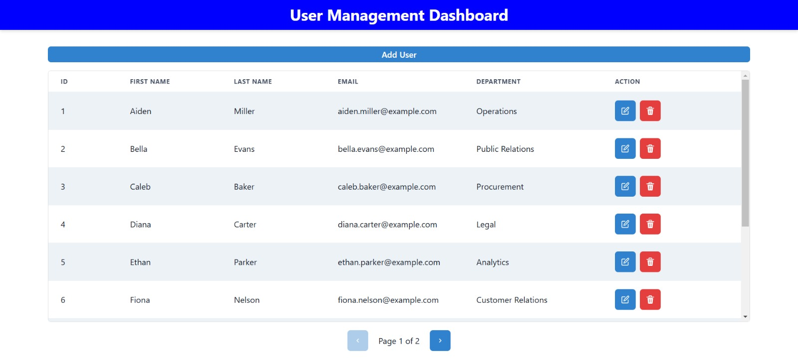
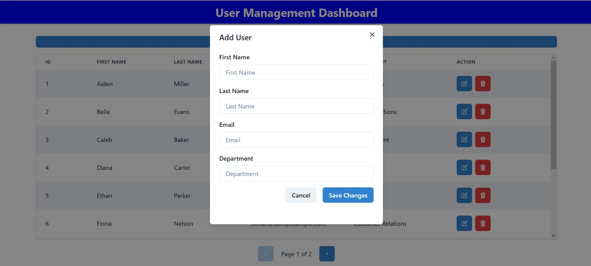
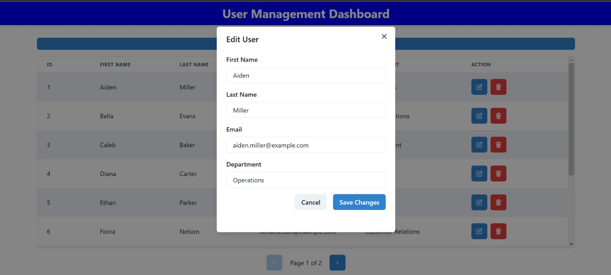
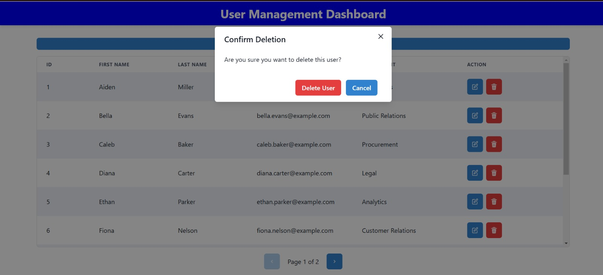

# User Management Application

This is a user management application built with React, Chakra UI, and integrated with an API to handle user operations. It supports features such as adding, editing, deleting, and paginating users. The app also includes form validation, confirmation modals, and toast notifications to indicate success or failure of operations.

## Features

- **Pagination**: Displays users in pages (10 per page) with navigation options to go to the next or previous page.
- **Add User**: A form to add new users with form validation to ensure required fields are filled out.
- **Edit User**: Ability to update existing users' information via a modal that pre-populates with the current user data.
- **Delete User**: Prompts for confirmation before deleting a user, with the option to cancel.
- **Toast Notifications**: Success or error notifications displayed after actions like adding, editing, or deleting a user.
- **Form Validation**: Ensures that form inputs are validated before submitting to avoid invalid data.

## Screenshots

### 1. Home Page


## 2. Add User


## 2. Edit User


## 3. Delete User



## Folder Structure
```
User-Management-Dashboard/
│
├── src/
│   |──── api           
│   │      └── userService.js
|   |──── assets        
│   |──── Components
|   |          └──── Navbar.jsx                   
│   |          |──── UseForm.jsx
|   |        |──── UserList.jsx
|   |──── contexts
|   |         └──── modalContainer.jsx
|   |         |──── modalContext.jsx
|   |──── pages
|   |         └── Dashboard.jsx
|   |──── App.css
|   |──── index.css
|   |──── main.jsx
|
├── package.json             
└── package-lock.json         
```


## Setup and Run Instructions

To get started with the project, follow these steps:

### 1. Clone the Repository

```bash
https://github.com/sumit1921184/Ajackus-Assignment.git

cd user-management-app
```

### 2. Install Dependencies

```bash
npm install
```

### 3. Run the Application

```bash
npm run dev
```
## API Endpoints

### User Endpoints
- **GET /api/users?_page={page}&_perPage={limit}**:  Fetches a paginated list of users.
- **GET /api/users/{id}**: Fetches a single user by ID.
- **POST /api/users**: Adds a new user.
- **PUT /api/users/{id}**: Updates an existing user.
- **DELETE /api/users/{id}**: Deletes a user.
## Challenges Faced
During the development of the user management application, the following challenges were encountered:

- **API Integration:** Ensuring smooth integration with the backend API for CRUD operations was initially a challenge. Handling edge cases like failed requests or server errors required careful attention.

- **Pagination:** Implementing dynamic pagination with Chakra UI components was a challenge, as it required managing state correctly to reflect the current page and total pages.

- **Form Validation:** Implementing real-time form validation for user input was a bit tricky, but using libraries like Chakra UI and custom validation functions helped simplify the process.

- **Modals and Toasts:** The modal and toast system had to be integrated carefully to ensure that user actions were properly communicated (e.g., confirming deletion or adding a new user).

## Improvement For Futures
If given more time, the following improvements would be made:

- **Improve UI/UX:** The user interface can be enhanced with more detailed user feedback, like loading spinners for API calls or a confirmation dialog for form submissions.
- **Advanced Error Handling:** Error handling can be expanded to show more descriptive messages, especially when API requests fail, to improve the user experience.
- **Optimizing Performance:** For larger datasets, introducing features like lazy loading or infinite scrolling can improve performance.
- **Accessibility:** Adding better accessibility features like keyboard navigation and screen reader support could make the app more inclusive.
- **Testing:** Adding unit tests and integration tests to ensure that the application behaves as expected, especially with CRUD operations and pagination.
- **Advanced Filtering, Sorting, and Searching:** Implementing features to filter users based on roles, names, or custom criteria, sorting them alphabetically or by creation date, and enabling full-text search for quick access.
## Conclusion
This user management app provides a simple interface to manage users, with essential features like pagination, adding/editing users, and handling operations securely. While there were challenges in integrating the API and handling form validation, the project helped me understand the full flow of managing users in a modern web application.

This app serves as a good foundation for building more advanced user management systems and can be further enhanced by optimizing the backend and improving the frontend user experience.

